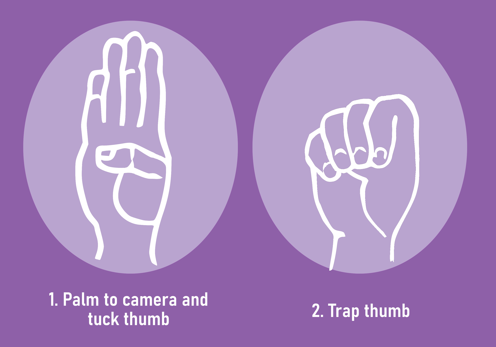
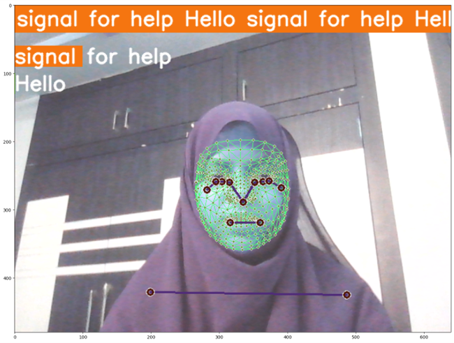

# major.project.73
highway road safety
Highways are more dangerous while traveling alone and at nighttime due to creepy and quiet roads finding no one to help when needed. To enhance safety, we have developed a system that allows individuals in distress to signal for help through specific hand gestures. Our proposed model, integrated with CCTV systems, detects these gestures and can be used to send alerts to nearby emergency services.

The Highways can present safety challenges, especially at night when fewer people are around, leaving individuals vulnerable in emergencies. In these situations, seeking help or using mobile phones may be difficult. To address these concerns, we've developed a solution aimed at training a model to recognize a specific hand sign gesture.

This offers a simple way for distressed individuals to request assistance. Our motivation for this project comes from our dedication to ensuring everyone's safety, particularly in dangerous highway situations. Our primary objective is to create a model to swiftly detect the hand gesture provided for help. We aim to provide immediate assistance to those in distress and ensure their well-being on the highways. The central focus is to integrate this model into existing highway cameras. When the model detects someone in distress, it promptly sends a message or calls the nearest police or helpline office to provide swift aid. By training the model to recognize a specific hand sign gesture, we establish a straightforward yet effective means of communication for individuals facing danger. When someone raises their hand and makes the designated sign, the connected CCTV cameras immediately detect the signal and initiate a call to the nearest police or helpline office, guaranteeing a rapid response and location tracking. 

Our main aim is to bridge the response gap during nighttime emergencies by harnessing advanced computer vision technology to protect lives on the highways. We are committed to offering an inclusive and user-friendly solution, empowering individuals who may encounter difficulties with mobile phones or verbal communication during crises. The driving force behind our efforts is the vision of a safer and more secure environment for all, regardless of the time of day or communication abilities. Our dedication is to positively impact people's well-being, enabling them to travel confidently, knowing that help is just a hand gesture away. We aspire to create a safer and more supportive highway experience for everyone, ensuring that no one feels alone or helpless during their journey.
